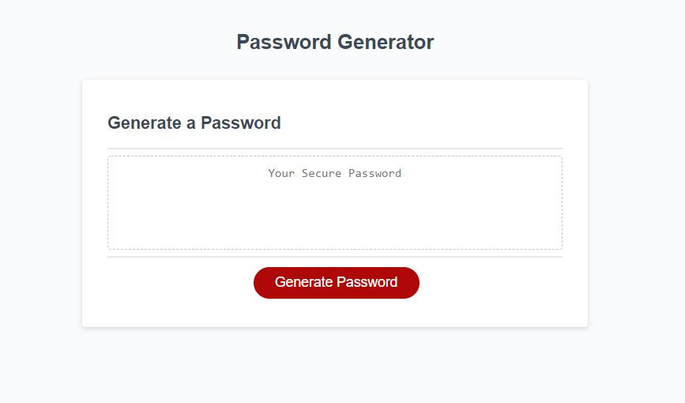
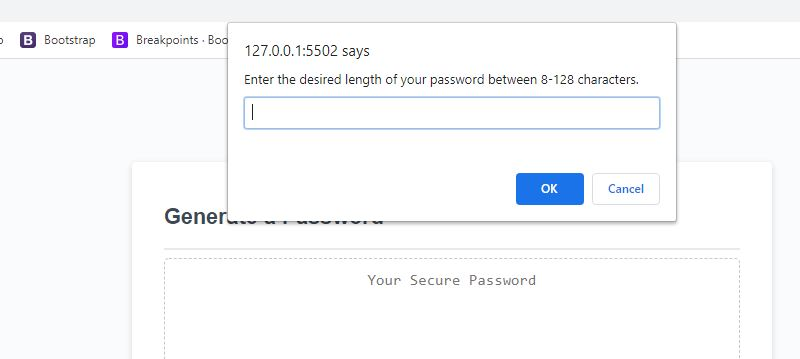
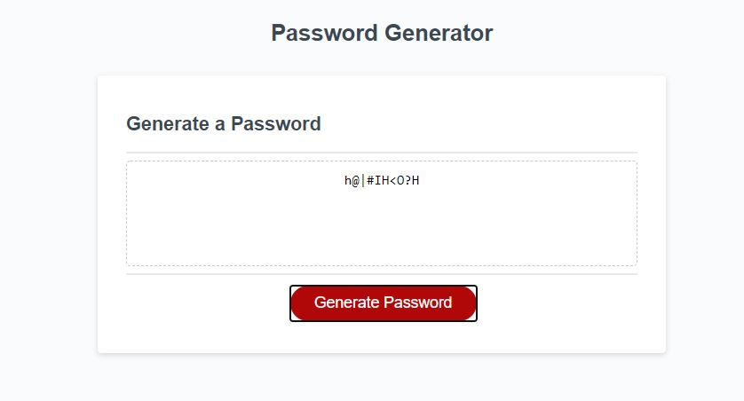

# Random Password Generator

## Description
This program is designed to generate a random password based on the criteria of the users. Once the 'Generate Password' button is pressed the user is prompted to enter the character length of the password. Once password length is determined than user must decide on which character types to have included in the password. The character type choices are special characters, numeric characters, lower case letters, and/or upper case letters. Once the selections had been made then the randomized password is generated in the text display box.

## What I Learned
I learned the the power of using functions and creating a javascript file that is organized and easy to read. I learned how to better us while loops and how to create a new array which comprises of already existing arrays. 

## Technologis Used
- Java Script
- HTML
- CSS

## Screen Shots
;
;
;

## Links
https://jason-jorgensen.github.io/Password-Generator/index

https://github.com/Jason-Jorgensen/Password-Generator
